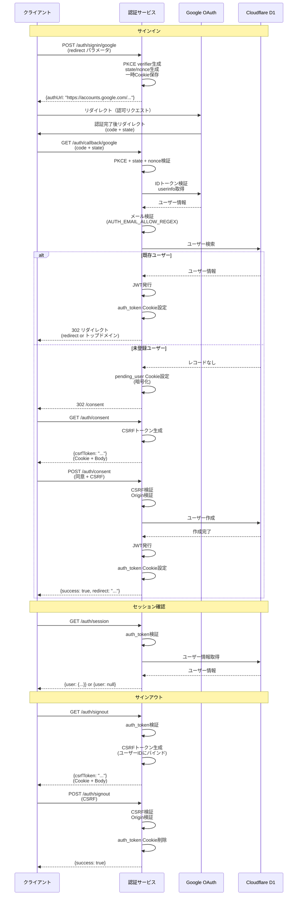

## Mahora Auth

Next.js（App Router）と Cloudflare Workers（OpenNext）上で動作する Google OAuth 2.0 + PKCE 認証サービスです。Cloudflare D1 に登録済みのユーザーのみを許可し、JWT を認証ホスト専用の HttpOnly Cookie に保存します。

## 技術スタック

- Next.js 15 / React 19 / TypeScript / App Router
- OpenNext for Cloudflare + Worker runtime（Edge）
- Cloudflare D1（ユーザー情報の永続化）
- Tailwind CSS v4, framer-motion, lucide-react
- Iron (iron-webcrypto) を用いた Cookie 暗号化・CSRF トークン保護

## 認証フロー



1. **POST `/auth/signin/google`**  
   - 任意の `redirect`（トップドメイン、または `AUTH_TRUSTED_ORIGINS` から生成されたOriginと完全一致するURLのみ許可）を受け取り、Google 認可 URL を JSON で返却。
   - `oauth_state` / `oauth_nonce` / `pkce_verifier` / `oauth_redirect` を HttpOnly 一時 Cookie に保存。
2. **Google OAuth**  
   - `AUTH_URL/auth/callback/google` にリダイレクト。PKCE + state + nonce を検証し、ID トークン検証と `userinfo` 取得を実施。
3. **利用可否判定**  
   - `AUTH_EMAIL_ALLOW_REGEX` に一致し、メール検証済みであることを確認。  
   - D1 に既存レコードがあれば JWT を発行し、`auth_token` Cookie をセットして許可されたリダイレクト先（存在しない場合はサブドメインなしのトップドメイン）へ 302。
4. **未登録ユーザーの同意フロー**  
   - レコードが無い場合は `pending_user`（暗号化）Cookieを発行し、`/consent` ページへ 302。  
   - **GET `/auth/consent`** で CSRF トークンを払い出し（`csrf_token` Cookie + レスポンス Body）。  
   - **POST `/auth/consent`** でユーザー同意を受け取り、D1 に作成→JWT 発行→`pending_user.redirect`、存在しない場合はトップドメインへ遷移。
5. **セッション確認**  
   - **GET `/auth/session`** は認証ホスト専用Cookieを検証し、D1 から `id`/`email`/`given_name`/`family_name`/`display_name`/`created_at` を返却。無効時は `user: null`。
   - 許可された別Originからは `credentials: 'include'` 付きで呼び出します。レスポンスは資格情報付きCORSに対応します。
6. **サインアウト**  
   - **GET `/auth/signout`** で `auth_token` を検証し、ユーザー ID にバインドした CSRF トークンを払い出し。  
   - **POST `/auth/signout`** で CSRF と Origin を検証後 `auth_token` を削除。

## API エンドポイント一覧

| Method | Path | 内容 | 代表的なレスポンス |
| ------ | ---- | ---- | ------------------ |
| POST | `/auth/signin/google` | 認可開始。PKCE 用 Cookie 設定。 | `{"authUrl": "https://accounts.google.com/..."}` |
| GET | `/auth/callback/google` | Google コールバック処理。JWT を発行 or `/consent` へ 302。 | 302 / JSON エラー |
| GET | `/auth/consent` | 暗号化 CSRF トークン払い出し。 | `{"csrfToken": "<encrypted>"}` |
| POST | `/auth/consent` | 同意確定。必要に応じて D1 にユーザー作成。 | `{"success": true, "redirect": "https://..."}` |
| GET | `/auth/session` | JWT + D1 によりセッション取得。 | `{"user": {...}}` or `{"user": null}` |
| GET | `/auth/signout` | サインアウト用 CSRF トークン払い出し。 | `{"csrfToken": "<encrypted>"}` |
| POST | `/auth/signout` | CSRF / Origin 検証後に Cookie 削除。 | `{"success": true}` |

## Cookie とセキュリティ

- `__Host-auth_token`：HS256 JWT。認証ホスト専用で、`Secure` / `HttpOnly` / `SameSite=Lax` / `Path=/` を常に付与。`Max-Age = AUTH_TOKEN_MAX_AGE`。
- 一時 Cookie：`__Host-oauth_state`, `__Host-oauth_nonce`, `__Host-pkce_verifier`, `__Host-oauth_redirect`。寿命は `TEMP_COOKIE_MAX_AGE`（未指定時 180 秒）。
- `__Host-pending_user`：`ENCRYPTION_SECRET` で Iron 暗号化。メールアドレスと `redirect` を保持。
- `__Host-csrf_token`：`CSRF_SECRET` で暗号化し、メールまたはユーザー ID のハッシュにバインド。`GET` でCookieとレスポンスBodyへ配布し、`POST` 時に両者の一致・Originを検証。
- `redirect` パラメータはトップドメイン、または `AUTH_TRUSTED_ORIGINS` から生成されたOriginと完全一致するHTTPS URLのみ許可します。`NEXTJS_ENV=development` の場合だけ localhost のHTTPも許可します。
- 旧 `auth_token` などの親ドメインCookieは移行時に削除され、認証には使用されません。

## D1 スキーマ

```sql
CREATE TABLE IF NOT EXISTS users (
  id TEXT PRIMARY KEY NOT NULL,
  email TEXT UNIQUE NOT NULL,
  given_name TEXT NOT NULL,
  family_name TEXT NOT NULL,
  display_name TEXT NULL,
  created_at DATETIME NOT NULL
);
```

スキーマの適用方法は「npm スクリプト」セクションを参照してください。

## 環境変数一覧

### 必須環境変数

| 変数 | 説明 | 例 |
| ---- | ---- | -- |
| `AUTH_URL` | この認証サービスの公開 URL | `https://auth.example.com` |
| `AUTH_TOKEN_MAX_AGE` | `auth_token` / CSRF トークン寿命（秒） | `604800` |
| `AUTH_EMAIL_ALLOW_REGEX` | 許可メール判定の正規表現 | `^.+@example\\.com$` |
| `NEXTJS_ENV` | OpenNext ビルドモード | `production` または `development` |
| `GOOGLE_CLIENT_ID` | Google OAuth クライアント ID | - |
| `GOOGLE_CLIENT_SECRET` | Google OAuth クライアント Secret | - |
| `JWT_SECRET` | `auth_token` 署名用のシークレット（HS256） | - |
| `ENCRYPTION_SECRET` | `pending_user` など Iron 暗号化用のシークレット | - |
| `CSRF_SECRET` | `csrf_token` の暗号化/復号用のシークレット | - |
| `NEXT_PUBLIC_TERMS_URL` | 利用規約の URL | `https://example.com/terms` |
| `NEXT_PUBLIC_PRIVACY_POLICY_URL` | プライバシーポリシーの URL | `https://example.com/privacy` |
| `NEXT_PUBLIC_SUPPORT_EMAIL` | サポートメールアドレス | `support@example.com` |
| `D1_DATABASE_NAME` | D1 データベース名 | - |
| `D1_DATABASE_ID` | D1 データベース ID | - |

### 任意環境変数

| 変数 | 説明 | 既定値 |
| ---- | ---- | ------ |
| `TEMP_COOKIE_MAX_AGE` | 一時 Cookie（state, nonce, pending_user）の寿命（秒） | `180` |
| `AUTH_TRUSTED_ORIGINS` | 追加で許可するサブドメインラベル。カンマ区切り | 未指定 |

### 複数サブドメインから利用する場合

認証サービスを `auth.example.com`、フロントエンドを `app.example.com`、`admin.example.com`、`portal.example.com` で利用する場合は、次のようにOriginを完全一致で登録します。

```dotenv
AUTH_URL=https://auth.example.com
AUTH_TRUSTED_ORIGINS=app,admin,portal
```

- 利用するフロントエンドのサブドメインラベルを、`AUTH_TRUSTED_ORIGINS` にカンマ区切りで指定します。
- `AUTH_URL=https://auth.example.com` の場合、`app` は `https://app.example.com`、`admin` は `https://admin.example.com` として扱われます。
- 戻り先が取得できない場合は、`AUTH_URL` から先頭ラベルを除いた `https://example.com/` へ戻ります。トップドメインは自動的に許可されます。
- ラベルには英小文字・数字・ハイフンだけを使用できます。完全URL、ドット、パス、ワイルドカードは指定できません。
- `NEXTJS_ENV=development` の場合に限り、`localhost` または `localhost:3001` の形式も指定できます。この場合はHTTP Originとして扱われます。
- 各フロントエンドは認証サービスの `/auth/signin/google`、`/auth/session`、`/auth/signout` を `credentials: "include"` 付きで呼び出します。
- セッションCookieは `auth.example.com` 専用です。各サブドメインへCookieや `JWT_SECRET` を共有する必要はありません。
- 旧親ドメインCookieの削除対象Domainも `AUTH_URL` から自動算出されます。
- `/auth/signin/google` を各サブドメインから直接呼ぶと、サーバーが `Referer` または `Origin` から許可済みの戻り先を自動判別し、短時間有効な `__Host-oauth_redirect` HttpOnly Cookieへ保存します。認証・初回同意の完了後にCookieを削除して元のサブドメインへ戻ります。
- Referrer Policyによりパスが送信されない場合でも、`Origin` から元のサブドメインを判別できます。元のパス・クエリまで確実に復元したい場合だけ、リクエストBodyの `redirect` に現在のURLを指定します。

search paramsを使わず、元のサブドメインを自動判別させるログイン例:

```ts
const response = await fetch(
  "https://auth.example.com/auth/signin/google",
  {
    method: "POST",
    credentials: "include",
  },
);
if (!response.ok) throw new Error("Failed to start sign in");

const { authUrl } = (await response.json()) as { authUrl: string };
window.location.assign(authUrl);
```

ログイン開始・セッション確認・サインアウトの実装例は [token_reference.md](./token_reference.md) を参照してください。

**注意**: これらの環境変数は `.env` ファイルに設定し、暗号化してリポジトリにコミットします。ローカル開発時は `.env.local` に設定してください。

## 環境変数管理（dotenvx）

このプロジェクトでは [dotenvx](https://github.com/dotenvx/dotenvx) を使用して環境変数を管理します。

### ローカル開発用

- `.env.local` に環境変数を設定（gitignore に含まれます）
- `.env` を参考に必要な環境変数を設定してください

### 本番用（暗号化）

- `.env` ファイルを直接暗号化してリポジトリにコミットします
- 暗号化キーは GitHub Secrets の `DOTENVX_KEY` に保存します
- ローカル開発時は `.env.local` を使用します（`.env` は暗号化されているため使用不可）

### 環境変数の管理方法

#### 環境変数の追加・更新

`dotenvx set` コマンドを使用して環境変数を追加・更新します:

```bash
pnpm exec dotenvx set KEY=value --file .env
```

複数の環境変数を一度に設定する場合:

```bash
pnpm exec dotenvx set KEY1=value1 KEY2=value2 --file .env
```

#### `.env` の暗号化

1. `.env` ファイルに環境変数を設定（`dotenvx set` を使用）
2. 以下のコマンドで `.env` 自体を暗号化（上書き）:
   ```bash
   pnpm exec dotenvx encrypt --file .env
   ```
3. 暗号化キーを GitHub Secrets の `DOTENVX_KEY` に設定（初回のみ）
4. 暗号化された `.env` をコミット

**注意**: `.env` を暗号化すると、ローカル開発時は使用できなくなります。必ず `.env.local` でローカル用の環境変数を設定してください。

`initOpenNextCloudflareForDev()` により `pnpm run dev` 実行時に Miniflare + ローカル D1 が自動で立ち上がるため、別コマンドでの DB 起動は不要です。

## 開発フロー

1. 依存関係のインストール: `pnpm install`
2. `.env.local` を作成し上記の値を設定（`.env` を参考）
3. ローカル D1 にスキーマ適用: `pnpm run db:schema`
4. 開発サーバー: `pnpm run dev`（`http://localhost:3000` を開く）

## npm スクリプト

- `pnpm run dev` : Next.js 開発サーバー（Turbopack、dotenvx で `.env.local` を使用）
- `pnpm run build` : Next.js 本番ビルド（dotenvx で環境変数を読み込み）
- `pnpm run lint` : ESLint
- `pnpm run deploy` : `opennextjs-cloudflare build` → `deploy`（Workers へ）
- `pnpm run preview` : 本番と同一バンドルで Cloudflare Preview を起動（dotenvx で環境変数を読み込み）
- `pnpm run cf-typegen` : `wrangler types` による `cloudflare-env.d.ts` 生成
- `pnpm run db:schema` : ローカル D1 にスキーマを適用
- `pnpm run db:reset` : ローカル D1 をリセット（テーブル削除 → 再作成）
- `pnpm run db:list` : ローカル D1 のデータを確認

**本番 D1 へのスキーマ適用**: `wrangler d1 execute DB --file=./schema.sql`

## デプロイ手順（Cloudflare Workers）

### GitHub Actions 経由（推奨）

#### 必要な設定

GitHub リポジトリの Settings → Secrets and variables → Actions で以下を設定してください。

##### Secrets（機密情報）

| Secret 名 | 説明 | 取得方法 |
| --------- | ---- | -------- |
| `DOTENVX_KEY` | `.env` ファイルの復号キー | `dotenvx encrypt` 実行時に生成されるキー |
| `CLOUDFLARE_API_TOKEN` | Cloudflare API トークン | [Cloudflare Dashboard](https://dash.cloudflare.com/profile/api-tokens) で作成（`Edit Cloudflare Workers` 権限が必要） |
| `CLOUDFLARE_ACCOUNT_ID` | Cloudflare アカウント ID | [Cloudflare Dashboard](https://dash.cloudflare.com/) の右サイドバーから取得 |

##### 環境変数の設定

必要な環境変数は「環境変数一覧」セクションを参照してください。これらは `.env` ファイルに含めて暗号化してください（GitHub Secrets/Variables には設定不要）。

#### デプロイフロー

1. 上記の Secrets を GitHub に設定
2. `.env` ファイルに環境変数を設定し、暗号化してコミット
3. `main` ブランチへの push で自動デプロイが開始されます
4. GitHub Actions が自動で `.env` を復号し、ビルド・デプロイを実行

### 手動デプロイ

1. `wrangler login` → `wrangler d1 create ...` → `wrangler d1 binding` を完了し、`wrangler.jsonc` の `d1_databases` を更新
2. `.env` を復号: `pnpm exec dotenvx decrypt --file .env`
3. `pnpm run build` でビルド
4. 本番 D1 へスキーマ適用: `wrangler d1 execute DB --file=./schema.sql`
5. `pnpm run deploy`（Workers にデプロイ）
6. リハーサルとして `pnpm run preview` で Cloudflare 上の挙動を検証すると安全です

## その他補足

- `__Host-auth_token` のペイロード: `sub`, `email`, `name`, `avatar`, `iat`, `exp`。`name` は `family_name + ' ' + given_name`。
- `trustedRedirectOrFallback` により、許可リスト外のOriginが渡された際は常に `AUTH_URL` から算出したトップドメインに戻ります。
- `POST /auth/consent` は `AUTH_URL` のみ、`POST /auth/signout` は `AUTH_URL` と信頼済みフロントエンドOriginのみ許可します。
