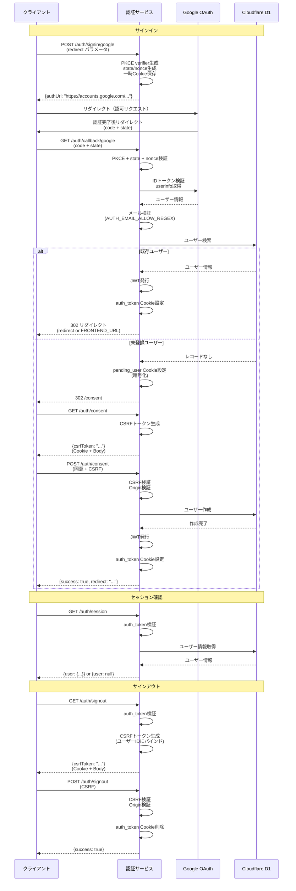

## Mahora Auth

Next.js 15（App Router）と Cloudflare Workers（OpenNext）上で動作する Google OAuth 2.0 + PKCE 認証サービスです。Cloudflare D1 に登録済みのユーザーのみを許可し、JWT を HttpOnly Cookie に保存してサブドメイン間で共有します。

## 技術スタック

- Next.js 15 / React 19 / TypeScript / App Router
- OpenNext for Cloudflare + Worker runtime（Edge）
- Cloudflare D1（ユーザー情報の永続化）
- Tailwind CSS v4, framer-motion, lucide-react
- Iron (iron-webcrypto) を用いた Cookie 暗号化・CSRF トークン保護

## 認証フロー



1. **POST `/auth/signin/google`**  
   - 任意の `redirect`（同一ドメイン HTTPS のみ許可）を受け取り、Google 認可 URL を JSON で返却。  
   - `oauth_state` / `oauth_nonce` / `pkce_verifier` / `oauth_redirect` を HttpOnly 一時 Cookie に保存。
2. **Google OAuth**  
   - `AUTH_URL/auth/callback/google` にリダイレクト。PKCE + state + nonce を検証し、ID トークン検証と `userinfo` 取得を実施。
3. **利用可否判定**  
   - `AUTH_EMAIL_ALLOW_REGEX` に一致し、メール検証済みであることを確認。  
   - D1 に既存レコードがあれば JWT を発行し、`auth_token` Cookie をセットして許可されたリダイレクト先（存在しない場合は `FRONTEND_URL`）へ 302。
4. **未登録ユーザーの同意フロー**  
   - レコードが無い場合は `pending_user`（暗号化）Cookieを発行し、`/consent` ページへ 302。  
   - **GET `/auth/consent`** で CSRF トークンを払い出し（`csrf_token` Cookie + レスポンス Body）。  
   - **POST `/auth/consent`** でユーザー同意を受け取り、D1 に作成→JWT 発行→`FRONTEND_URL` もしくは `pending_user.redirect` へ遷移。
5. **セッション確認**  
   - **GET `/auth/session`** は `auth_token` を検証し、D1 から `id`/`email`/`given_name`/`family_name`/`display_name`/`created_at` を返却。無効時は `user: null`。
6. **サインアウト**  
   - **GET `/auth/signout`** で `auth_token` を検証し、ユーザー ID にバインドした CSRF トークンを払い出し。  
   - **POST `/auth/signout`** で CSRF と Origin を検証後 `auth_token` を削除。

## API エンドポイント一覧

| Method | Path | 内容 | 代表的なレスポンス |
| ------ | ---- | ---- | ------------------ |
| POST | `/auth/signin/google` | 認可開始。PKCE 用 Cookie 設定。 | `{"authUrl": "https://accounts.google.com/..."}` |
| GET | `/auth/callback/google` | Google コールバック処理。JWT を発行 or `/consent` へ 302。 | 302 / JSON エラー |
| GET | `/auth/consent` | 暗号化 CSRF トークン払い出し。 | `{"csrfToken": "<encrypted>"}` |
| POST | `/auth/consent` | 同意確定。必要に応じて D1 にユーザー作成。 | `{"success": true, "redirect": "https://..."}` |
| GET | `/auth/session` | JWT + D1 によりセッション取得。 | `{"user": {...}}` or `{"user": null}` |
| GET | `/auth/signout` | サインアウト用 CSRF トークン払い出し。 | `{"csrfToken": "<encrypted>"}` |
| POST | `/auth/signout` | CSRF / Origin 検証後に Cookie 削除。 | `{"success": true}` |

## Cookie とセキュリティ

- `auth_token`：HS256 JWT。`AUTH_COOKIE_DOMAIN` 全域で共有。`SameSite=Lax`、`Secure` は `NODE_ENV=production` 時のみ、`Max-Age = AUTH_TOKEN_MAX_AGE`。
- 一時 Cookie：`oauth_state`, `oauth_nonce`, `pkce_verifier`, `oauth_redirect`。寿命は `TEMP_COOKIE_MAX_AGE`（未指定時 180 秒）。
- `pending_user`：`ENCRYPTION_SECRET` で Iron 暗号化。メールアドレスと `redirect` を保持。
- `csrf_token`：`CSRF_SECRET` で暗号化し、メールまたはユーザー ID のハッシュにバインド。`GET` で配布し、`POST` 時に Cookie とボディの一致・Origin を必須化。
- `redirect` パラメータは `AUTH_COOKIE_DOMAIN` 配下の HTTPS URL のみ許可し、無効な場合は `FRONTEND_URL` へフォールバックします。

## D1 スキーマとコマンド

```sql
CREATE TABLE IF NOT EXISTS users (
  id TEXT PRIMARY KEY NOT NULL,
  email TEXT UNIQUE NOT NULL,
  given_name TEXT NOT NULL,
  family_name TEXT NOT NULL,
  display_name TEXT NULL,
  created_at DATETIME NOT NULL
);
```

- ローカル適用: `npm run db:schema`
- リセット: `npm run db:reset`（users テーブルを DROP → 再作成）
- データ確認: `npm run db:list`
- 本番適用: `wrangler d1 execute DB --file=./schema.sql`

## 必須設定

### Wrangler `vars`

| 変数 | 説明 | 例 |
| ---- | ---- | -- |
| `AUTH_URL` | この認証サービスの公開 URL | `https://auth.example.com` |
| `FRONTEND_URL` | 認証後に戻す SPA/サイト | `https://example.com` |
| `AUTH_COOKIE_DOMAIN` | 共有 Cookie のルートドメイン（`.` から開始推奨） | `.example.com` |
| `AUTH_TOKEN_MAX_AGE` | `auth_token` / CSRF トークン寿命（秒） | `604800` |
| `AUTH_EMAIL_ALLOW_REGEX` | 許可メール判定 | `^.+@example\\.com$` |
| `NEXTJS_ENV` | OpenNext ビルドモード | `production` or `development` |

### Wrangler `d1_databases`

- `binding: "DB"` をこのリポジトリの D1 にマップしてください。

### Wrangler `secret`

| シークレット | 用途 |
| ------------ | ---- |
| `JWT_SECRET` | `auth_token` 署名（HS256） |
| `ENCRYPTION_SECRET` | `pending_user` など Iron 暗号化 |
| `CSRF_SECRET` | `csrf_token` の暗号化/復号 |
| `GOOGLE_CLIENT_ID` | Google OAuth クライアント ID |
| `GOOGLE_CLIENT_SECRET` | Google OAuth クライアント Secret |

### Next.js 公開環境変数

`next.config.ts` が未設定を許容しないため必須です。

- `NEXT_PUBLIC_TERMS_URL`
- `NEXT_PUBLIC_PRIVACY_POLICY_URL`
- `NEXT_PUBLIC_SUPPORT_EMAIL`

### 任意 / 補足

| 変数 | 説明 | 既定値 |
| ---- | ---- | ------ |
| `TEMP_COOKIE_MAX_AGE` | 一時 Cookie（state, nonce, pending_user）の寿命（秒） | `180` |
| `NODE_ENV` | `production` の場合のみ Cookie に `Secure` を付与 | `development` |

## `.dev.vars` 例

ローカル開発時は `.dev.vars` に **vars** + **secrets** + **NEXT_PUBLIC\*** をまとめて記述します。
.dev.vars.example をご参照ください。

`initOpenNextCloudflareForDev()` により `npm run dev` 実行時に Miniflare + ローカル D1 が自動で立ち上がるため、別コマンドでの DB 起動は不要です。

## 開発フロー

1. 依存関係のインストール: `npm install`
2. `.dev.vars` を作成し上記の値を設定
3. ローカル D1 にスキーマ適用: `npm run db:schema`
4. 開発サーバー: `npm run dev`（`http://localhost:3000` を開く）

## npm スクリプト

- `npm run dev` : Next.js 開発サーバー（Turbopack）
- `npm run build` / `npm run start` : Next.js 本番ビルド & Node サーバー
- `npm run deploy` : `opennextjs-cloudflare build` → `deploy`（Workers へ）
- `npm run preview` : 本番と同一バンドルで Cloudflare Preview を起動
- `npm run lint` : ESLint
- `npm run cf-typegen` : `wrangler types` による `cloudflare-env.d.ts` 生成
- `npm run db:schema` / `db:reset` / `db:list` : D1 ユーティリティ

## デプロイ手順（Cloudflare Workers）

1. `wrangler login` → `wrangler d1 create ...` → `wrangler d1 binding` を完了し、`wrangler.jsonc` の `d1_databases` を更新。
2. `wrangler secret put` で Secrets を登録し、`wrangler variables` or `wrangler.toml` で `vars` を設定。
3. `npm run build`
4. 本番 D1 へスキーマ適用: `wrangler d1 execute DB --file=./schema.sql`
5. `npm run deploy`（Workers にデプロイ）
6. リハーサルとして `npm run preview` で Cloudflare 上の挙動を検証すると安全です。

## その他補足

- `auth_token` のペイロード: `sub`, `email`, `name`, `picture`, `iat`, `exp`。`name` は `family_name + ' ' + given_name`。
- `sameDomainRedirectOrFallback` により `http://` や別ドメインが渡された際は常に `FRONTEND_URL` に戻ります。
- `verifyOrigin` によって `POST /auth/consent` と `POST /auth/signout` は `AUTH_URL`/`FRONTEND_URL` からのリクエストのみ許可されます。
